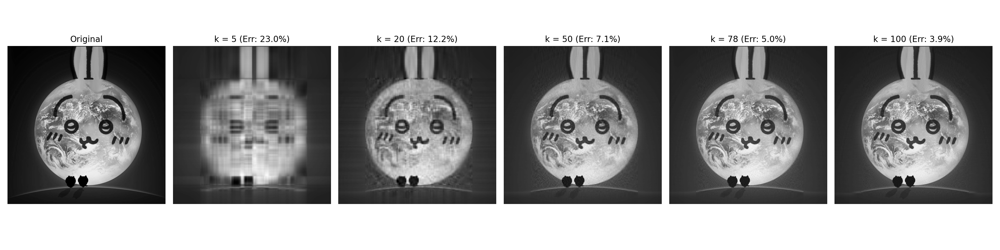

# Image Compression via SVD-based Low-Rank Approximation

## 1. Introduction
This project explores **Singular Value Decomposition (SVD)** to implement lossy image compression. By using low-rank approximation, it demonstrates how to significantly reduce data storage while maintaining essential visual information.

### The Real-World Problem (Motivation)
In the digital world, transmitting and storing high-resolution images consumes significant memory and bandwidth. For everyday applications—like loading a webpage, sending photos over a messaging app, or managing cloud storage—the core problem is: **How can we reduce file sizes to improve loading speeds and save space, without ruining the visual experience for the user?** This project uses image compression as a practical model to explore this problem. By translating an image into a mathematical matrix, I used SVD to filter out mathematically redundant data and analyzed the trade-off between file size and human-perceptible quality.

## 2. Mathematical Principle
An image matrix $A$ is factorized into three constituent matrices:
$$A = U \Sigma V^T$$

A compressed version $A_k$ is reconstructed by keeping only the top $k$ singular values (the "Rank-$k$ Approximation"):
$$A_k = U_k \Sigma_k V_k^T$$

### Error Measurement (Frobenius Norm)
To quantify the reconstruction distortion relative to the original image, the **Relative Frobenius Norm Error** is calculated as follows:

$$RelErr(k) = \frac{\|A - A_k\|_F}{\|A\|_F} \times 100\%$$

*The Frobenius norm $\| \cdot \|_F$ aggregates pixel-level differences into a single overall error value, representing the "total energy" of the matrix.*

### Storage Efficiency & Compression Ratio
The compression efficiency is determined by comparing the total elements required for storage:
* **Original Storage**: $m \times n$ (Total pixels in the grayscale matrix)
* **Compressed Storage (SVD)**: $k(m + n + 1)$ (Storing $U_k$, $\Sigma_k$, and $V_k^T$)

#### 1. Storage Used (%)
$$\text{Storage Used} = \frac{k(m + n + 1)}{mn} \times 100\%$$

#### 2. Compression Ratio
$$\text{Compression Ratio} = \frac{\text{Original Storage}}{\text{Compressed Storage}} = \frac{mn}{k(m + n + 1)}$$

## 3. Implementation Steps
The image compression was achieved through the following systematic modeling process:

1.  **Preprocessing**: Load the source image (`my_image.jpg`) and convert it into a grayscale matrix $A$, normalizing pixel values to a $[0, 1]$ range for numerical stability and error calculation.
2.  **Factorization**: Apply the `numpy.linalg.svd` library function to decompose matrix $A$ into $U$, $\Sigma$, and $V^T$.
3.  **Truncation**: Select the top $k$ singular values and their corresponding vectors, effectively discarding high-frequency noise and less significant data.
4.  **Reconstruction**: Re-multiply the truncated matrices ($U_k \cdot \Sigma_k \cdot V_k^T$) to generate the compressed approximation $A_k$.
5.  **Evaluation**: Compare the visual results across different $k$ values and calculate the mathematical error to identify the optimal balance.

## 4. Experimental Results & Analysis
*Tested on a $1000 \times 1000$ grayscale image.*



| Rank ($k$) | Storage Used (%) | Compression Ratio | Relative Error (%) | Visual Quality (Observation) |
| :--- | :--- | :--- | :--- | :--- |
| 5 | 1.00% | 100:1 | 22.98% | Significant blur; only basic outlines visible. |
| 20 | 4.00% | 25:1 | 12.17% | Features appear but edges are heavily aliased. |
| 50 | 10.01% | 10:1 | 7.07% | High quality; suitable for web thumbnails. |
| **78** | **15.61%** | **6.4:1** | **5.00%** | **Optimal trade-off: Balanced size and quality.** |
| 100 | 20.01% | 5:1 | 3.94% | Visually near-lossless; near-identical to original. |

### Discussion: Why $k=78$ is the "Sweet Spot"?
Based on the experimental data, **$k=78$** emerges as the optimal point of **Diminishing Returns**:
1. **Perceptual Fidelity**: At ~5% relative error ($k=78$), the reconstruction is visually indistinguishable from the original for most observers.
2. **Efficiency**: Increasing $k$ from 78 to 100 increases storage usage by ~5% but only improves mathematical accuracy by ~1%. Thus, $k=78$ provides the highest "value" per byte stored.

## 5. Reflections & Future Work
This project provides hands-on experience in translating abstract linear algebra concepts (matrix factorization) into functional Python code. Experimenting with different $k$ values highlights the practical trade-off between data retention and storage efficiency.

* **Applied Modeling**: This experiment was a practical introduction to mathematical modeling. It showed me how to take a real-world problem (reducing file size), translate it into a math problem (matrix factorization), and solve it using code.
* **Next Steps**: A natural next step is to extend this script to process color images, which requires handling 3D arrays (RGB channels) instead of 2D matrices.

## 6. How to Run
1.  Install dependencies:
    ```bash
    pip install -r requirements.txt
    ```
2.  Run the script:
    ```bash
    python3 math2blSVD.py
    ```

---

*Developed as an Applied Modeling Project for Math 2BL (Applied Linear Algebra Lab). This project is part of an Applied Mathematics Learning Portfolio. — Winter 2026.*